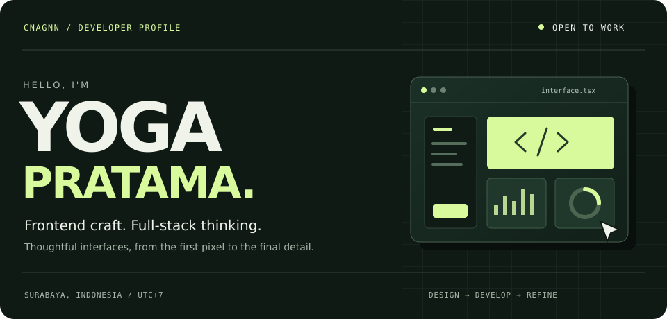
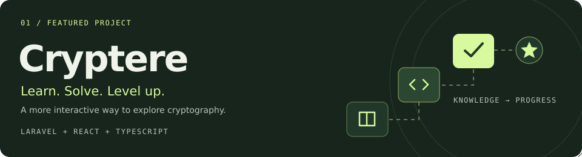
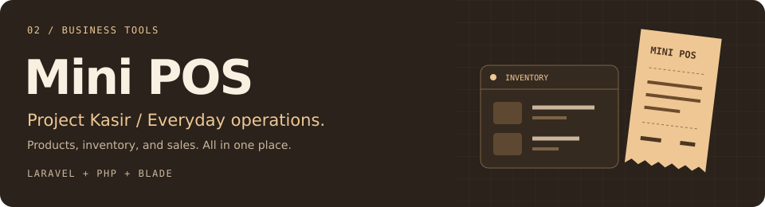
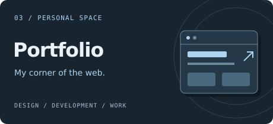
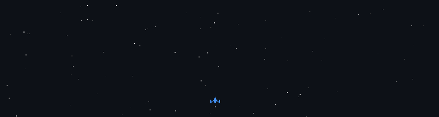
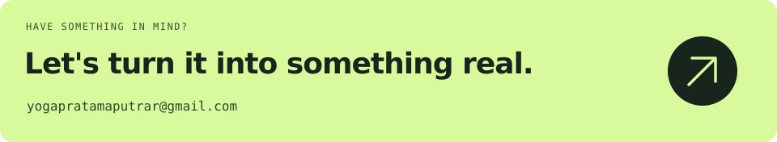

  

  <a href="#01--the-developer">About</a> &nbsp; / &nbsp;
  <a href="#02--selected-work">Selected work</a> &nbsp; / &nbsp;
  <a href="#03--the-toolkit">Toolkit</a> &nbsp; / &nbsp;
  <a href="#04--behind-the-builds">Activity</a> &nbsp; / &nbsp;
  <a href="#05--lets-build-something">Contact</a>

 

## 01 / The developer

<table>
  <tr>
    <td width="65%" valign="top">
      <h3>Good interfaces make complex things feel simple.</h3>
      
I'm <strong>Yoga Pratama Putra Rizqulloh</strong>, a web developer who enjoys turning ideas into clear, responsive experiences. My focus is frontend development, with full-stack experience connecting interfaces to the logic and data behind them.

      
I work with <strong>React, TypeScript, and Laravel</strong>, paying attention to the details that make a product feel right: reusable components, accessibility, consistent design, and maintainable code.

      <a href="https://cnagnn.github.io/Portfolio/"><strong>Explore my portfolio ↗</strong></a>
    </td>
    <td width="35%" valign="top">
      <h3>At a glance</h3>
      
BASED IN <strong>Surabaya, Indonesia</strong>

      
LOCAL TIME ZONE <strong>UTC+7 · Asia/Jakarta</strong>

      
MY SWEET SPOT <strong>Frontend × full stack</strong>

      
AVAILABILITY <strong>Open to work &amp; collaboration</strong>

    </td>
  </tr>
</table>

 

## 02 / Selected work

Three projects, from interactive learning to everyday business tools.

### Cryptere / Learn. Solve. Level up.

A cryptography e-learning platform that combines structured courses with interactive quizzes and coding challenges. XP, badges, and leaderboards make progress part of the learning experience.

`Laravel` `React` `TypeScript` `Inertia.js` `Tailwind CSS` `MySQL`

**[Explore the repository ↗](https://github.com/Cnagnn/Cryptere)**

 

<table>
  <tr>
    <td width="50%" valign="top">
      
      <h3>Project Kasir / Everyday operations</h3>
      
A web-based point-of-sale application for products, inventory, sales, purchases, and reports, with role-based access.

      
<code>Laravel</code> <code>PHP</code> <code>Blade</code> <code>JavaScript</code> <code>CSS</code>

      
<a href="https://github.com/Cnagnn/Project_Kasir"><strong>Explore the repository ↗</strong></a>

    </td>
    <td width="50%" valign="top">
      
      <h3>Portfolio / My corner of the web</h3>
      
A personal website bringing together my background, selected projects, experience, and web development services.

      
<code>HTML</code> <code>CSS</code> <code>JavaScript</code>

      
<a href="https://cnagnn.github.io/Portfolio/"><strong>Visit the website ↗</strong></a> &nbsp; · &nbsp; <a href="https://github.com/Cnagnn/Portfolio">Source code</a>

    </td>
  </tr>
</table>

 

## 03 / The toolkit

   &nbsp;
   &nbsp;
   &nbsp;
   &nbsp;
   &nbsp;
   &nbsp;
   &nbsp;
  

| Layer | What I use |
| :--- | :--- |
| **Interface** | React · Vue.js · TypeScript · JavaScript · HTML · CSS |
| **Styling** | Tailwind CSS · Bootstrap |
| **Application** | Laravel · PHP · Inertia.js · Blade · Node.js |
| **Data** | MySQL |
| **Workflow** | Git · Vite · VS Code · Figma · Postman |

### How I approach a build

<table>
  <tr>
    <td width="33%" valign="top">
      01 — STRUCTURE
      <h4>Make it clear.</h4>
      
Understand the user journey. Break the interface into focused, reusable components.

    </td>
    <td width="34%" valign="top">
      02 — CONNECT
      <h4>Make it work.</h4>
      
Connect the UI to application logic and data, with thoughtful states and interactions.

    </td>
    <td width="33%" valign="top">
      03 — REFINE
      <h4>Make it feel right.</h4>
      
Check responsiveness, accessibility, and performance. Pay attention to the small details.

    </td>
  </tr>
</table>

### Experience

**Frontend Web Developer Intern** · CV. OTW Computer Gusaha 
SEPTEMBER — DECEMBER 2025

 

## 04 / Behind the builds

A small window into my GitHub activity. These visuals use my contribution data and refresh daily.

  
<strong>Open the contribution city ↗</strong> — an isometric view of the past year

   
  

  
<strong>Launch the arcade ↗</strong> — contributions, space-shooter style

   
  

Built with <a href="https://github.com/lowlighter/metrics">Metrics</a> and <a href="https://github.com/czl9707/gh-space-shooter">GitHub Space Shooter</a> · <a href="https://github.com/Cnagnn/Cnagnn/actions/workflows/city.yml">View workflow</a>

 

## 05 / Let's build something

Have a role, a project, or an idea in mind? I'd love to hear about it.

  <a href="mailto:yogapratamaputrar@gmail.com"><strong>Email</strong></a> &nbsp; / &nbsp;
  <a href="https://www.linkedin.com/in/yogapratamaputrar/"><strong>LinkedIn</strong></a> &nbsp; / &nbsp;
  <a href="https://wa.me/6285156566915"><strong>WhatsApp</strong></a> &nbsp; / &nbsp;
  <a href="https://cnagnn.github.io/Portfolio/"><strong>Portfolio</strong></a>

 

  YOGA PRATAMA &nbsp; / &nbsp; CNAGNN &nbsp; / &nbsp; BUILT WITH INTENTION

